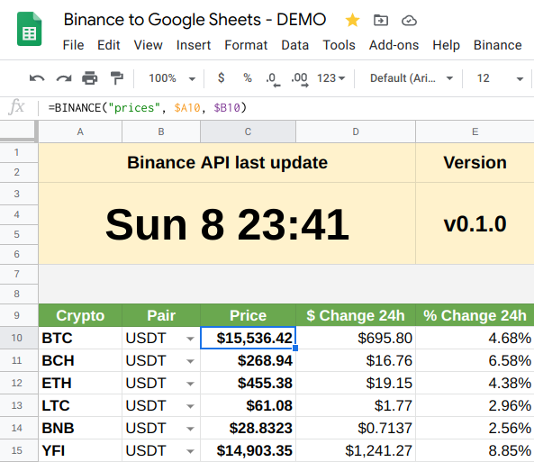

# Binance to Google Sheets!

A lightweight **Google Spreadsheets Add-On** to GET data _directly_ from **Binance API** _without_ any intermediaries!

This `add-on` is basically an **API client** specially hand-crafted to work between Google Spreadsheets and Binance.  
By using the `BINANCE()` formula in your spreadsheet, you can get data fetched from Binance API like:  
* Current market [prices](#operation-prices-public)
* Historical market [OHLCV](#operation-history-public)
* Last [24h stats](#operation-stats24h-public)
* Total [account assets](#operation-account-private) from Binance wallets (SPOT + CROSS + ISOLATED + FUTURES + SUB-ACCOUNTS)
* All current [open orders](#operation-ordersopen-private) (SPOT + CROSS + ISOLATED + FUTURES)
* Latest [done/finished orders](#operation-ordersdone-private) (SPOT + CROSS + ISOLATED + FUTURES)
* Historical [orders table](#operation-orderstable-private) (SPOT + CROSS + ISOLATED + FUTURES)
* Last data [update time](#operation-last_update-public) and current [add-on version](#operation-version-public) being used
* ..and many more to come!

At first glance, **NO Binance API key** is needed to call **public endpoints** like [current prices](#operation-prices-public), [historic prices](#operation-history-public) and [24h stats](#operation-stats24h-public).   
It **only** requires a [Binance API key](#binance-api-key) for **private endpoints** like [account info](#operation-account-private) and [open/done/table orders](#operation-ordersopen-private), but a **READ-ONLY** API key is enough for everything to work.  
In deed, I _personally recommend_ to generate a **READ-ONLY** API key at Binance site [here](https://www.binance.com/en/usercenter/settings/api-management).  
It does **NOT need** write/trade access **in ANY way** to properly work with all its features, so don't give extra permissions if they aren't needed!

I think and hope that many of you will find it as useful as it is for myself.  
Enjoy, cheers! :beers:

## How can I use it in my Google Spreadsheets?

First of all, open your desired Google Spreadsheet and configure it properly:
1. Go to `File -> Spreadsheet settings`.
2. Under the `Calculation` tab set the `Recalculation` combobox to `On change and every minute`.
3. Hit `Save settings` button and continue with the steps below!

### The quick'n easy way for everybody

Just [download the latest **BINANCE.gs**](https://github.com/diegomanuel/binance-to-google-sheets/releases/latest/download/BINANCE.gs) _all-in-one_ file + [**appsscript.json**](https://github.com/diegomanuel/binance-to-google-sheets/releases/latest/download/appsscript.json) and **copy & paste** its contents following these steps:

1. With your desired `Google Spreadsheet` opened, go to `Tools -> Script editor`.
    * It should open an editor in a new page with a `Code.gs` file containing an empty function.
    * Remove any contents from `Code.gs` and save the project at `File -> Save`. Give any name you want.
2. Go to project properties and make sure to select `Show "appsscript.json" manifest file in editor` checkbox.
3. Go back to code editor, select the `Code.gs` file and paste the contents from the downloaded `BINANCE.gs` file.
4. Do the same for `appsscript.json` and optionally set your desired timezone.
5. Save the project again and refresh/reload your Google Spreadsheet (hit `F5` on the browser).
    * Once reloaded, you should see a little message box (toast) at the bottom-right corner.
6. Go to `Binance` item at your spreadsheet's main menu and click on the `Authorize add-on!` item.
7. A Google's dialog should appear asking for permissions, proceed with all the steps and click `Allow`.
    * The popup will close and nothing will change on your spreadsheet yet!
8. Once the add-on is authorized, repeat step `5` (click `Authorize add-on!` again) and voila!

### If you are a developer  =]

You will need [node](https://nodejs.org) and [clasp](https://github.com/google/clasp) in order to apply the `add-on` to your Google Spreadsheets.  

1. Install `node` and `clasp` following their simple setup guides.
2. Clone the `repo` and login to your Google account with `clasp` by running: `clasp login`.
3. Get the `Script ID` for your desired Google Spreadsheet.
    1. With your `Google Spreadsheet` open, go to `Tools -> Script editor`.
    2. At the `Google Script` screen, go to `File -> Project properties`.
    3. The needed ID is the one under the `Script ID` label!
    4. Make sure to select `Show "appsscript.json" manifest file in editor` checkbox.
4. Just for the first time, run the target `make setup SCRIPT_ID=my-script-id` replacing `my-script-id` with the ID obtained at point `3`.
    * It should create the file `.clasp.json` with your `scriptId` inside for future use.
    * **NOTE:** You only need to re-run this step if you want to change the configured `scriptId`.
5. Now you can run `make push` (or just `make` alone) to upload/apply local code to your desired Google Spreadsheet!
    * From now on, you can just run `make` to keep applying changes to the same configured spreadsheet.
    * **TIP:** You can run `make update` to pull latest changes from this repo and push them to your configured spreadsheet.
6. Refresh/reload your Google Spreadsheet (hit `F5` on the browser).
    * Once reloaded, you should see a little message box (toast) at the bottom-right corner.
7. Go to `Binance` item at your spreadsheet's main menu and click on the `Authorize add-on!` item.
8. A Google's dialog should appear asking for permissions, proceed with all the steps and click `Allow`.
    * The popup will close and nothing will change on your spreadsheet yet!
9. Once the add-on is authorized, repeat step `7` (click `Authorize add-on!` again) and voila!

**Windows users:** You can download and use `make` from [here](https://sourceforge.net/projects/gnuwin32/files/make/3.81/) or even the entire [GnuWin](https://sourceforge.net/projects/gnuwin32/) toolset.

### Troubleshoot

Please take a look to the logs before opening an issue!  
https://script.google.com/u/0/home/executions

I'll try to answer all your questions but it takes time, dedication and effort to be there, so plz be patient!  
The add-on is working in a stable manner and the only recurrent problem is the `418` and `403` responses from Binance API, but there is nothing we can do since our spreadsheets runs on shared Google servers whose IP addresses are shared among all the Google users.

### Binance API Key

Only needed if you **also want** to call **private endpoints** from your spreadsheet.  
To get your keys, go to [Binance API panel](https://www.binance.com/en/usercenter/settings/api-management) and create a new one:

1. Enter a label like `Binance to Google Sheets` and click the `Create` button.
2. Take note for both `API Key` and `Secret Key` values.
3. Click the `Edit restrictions` button.
    1. Under `API restrictions` **ONLY** `Can Read` checkbox should be checked.  
    2. Under `IP access restrictions` select `Unrestricted`.
    3. Enable **futures** (read-only) if you also want to fetch data from there.
4. Click the `Save` button and now you have to configure them on your spreadsheet!

Once you have the `add-on` already installed/enabled on your desired Google Spreadsheet, the main menu item `Binance` should have appeared at the rightmost position.

1. At spreadsheet's main menu, go to `Binance -> Setup API Keys`.
2. Set your `API Key` and click `OK`. Do the same for `API Secret Key`.
3. Voila, you are ready to go!

**NOTE:** You can remove or re-configure them at any time from the `Binance` main menu item in your spreadsheet.

## OK, I have it installed! How do I use it at my spreadsheet?

**NOTE:** Check the **`Examples` sheet** in the **[live DEMO](https://docs.google.com/spreadsheets/d/1AcOcPFsncrDB_ve3wWMHwfiFql6A4hmG1sFc01LLTDg/edit#gid=1522299933)  spreadsheet** for more details.

You just need to call the `=BINANCE()` formula in a cell!  
Some operations are **public**, meaning they **don't need a Binance API key** to call'em.  
Some operations are **private**, meaning they **do require a Binance API key** to call'em.

**So far, these are the available operations:**

### Operation: `"version"` (public)
`=BINANCE("version")` will return the current `Binance to Google Sheets` version you are running.
* Be sure to check the [latest release](https://github.com/diegomanuel/binance-to-google-sheets/releases/latest) and update yours if needed.

### Operation: `"last_update"` (public)
`=BINANCE("last_update")` will return the timestamp of the last request/response from Binance API.
* The timestamp is updated every time we get a valid response from Binance API (status `200`, no matter what operation triggered it).

### Operation: `"prices"` (public)
`=BINANCE("prices")` will return a list with the latest prices from Binance.
* `=BINANCE("prices", "BTC")` Optionally you can give a symbol to just return its price (against `USDT` by default).
* `=BINANCE("prices", "BNB", "BTC")` Optionally you can give a ticker to compare against and to just return its price.
* `=BINANCE("prices", A1:A3)` Optionally you can give a ticker range to return a list of symbols and prices.
    * Values must be simple symbols like `A1="BTC"`, `A2="ETH"` and `A3="LTC"`.
* `=BINANCE("prices", A1:A3, "headers: false")` Optionally you can give more options like not returning table headers.
* `=BINANCE("prices", A1:A3, "ticker: BNB, prices: true")` Optionally you can return only the prices (and give a ticker in the meantime).

### Operation: `"history"` (public)
`=BINANCE("history", "BTCUSDT", "interval: 1h, limit: 24")` will return a list with the latest **24hr** OHLCV **hourly** data for given **full symbol/ticker** from Binance.  
* The **2nd** parameter is **required** and it must be a **valid** single full symbol/ticker, like: `"BTCUSDT"`, `"ETHBTC"`, etc.
* The **3rd** parameter supports the following options, in a single string separated by commas:
    * `"interval: 15m"`: Can be any supported value by Binance API, like: `1m`, `5m`, `1h`, `1d`, etc. Defaults to: `1h`
    * `"start: 2021-01-01"`: Optional. The start date/time to get data from. Can be any supported value by `new Date(value)` JS object, like: `2021-01-01-11-22-33` (time is converted to `:` format).
    * `"end: 2021-01-31"`: Optional. The end date/time to get data from. The same supported values as `start` option.
    * `"limit: 10"`: Optional. How many rows to return, from `1` to `1000`, defaults to: `500`.
    * `"headers: false"`: Don't return table headers.
* **IMPORTANT:** If any parameter value is wrong, Binance API will answer with a `400` status code.

### Operation: `"stats/24h"` (public)
`=BINANCE("stats/24h", A1:A3)` will return a list with the 24hs stats for given symbols from Binance.
* A single value like `"BTC"` or a range of values is **required**. Values must be simple symbols like `A1="BTC"`, `A2="ETH"` and `A3="LTC"`.
* `=BINANCE("stats/24h", A1:A3, "BTC")` Optionally you can give a ticker to match against (defaults to `USDT`).
* `=BINANCE("stats/24h", A1:A3, "ticker: BTC, headers: false")` Optionally you can give more options like not returning table headers.

### Operation: `"account"` (private)
`=BINANCE("account")` will return total account assets from Binance wallets (SPOT + CROSS + ISOLATED + FUTURES + SUB-ACCOUNTS).
* `=BINANCE("account", "spot")` Display assets summary for SPOT wallet.
* `=BINANCE("account", "cross")` Display assets summary for CROSS MARGIN wallet.
    * If you don't use this wallet (0 assets there), you should disable it from "Binance->Wallets" main menu.
* `=BINANCE("account", "isolated")` Display assets summary for ISOLATED MARGIN wallet.
    * If you don't use this wallet (0 assets there), you should disable it from "Binance->Wallets" main menu.
* `=BINANCE("account", "futures")` Display assets summary for FUTURES wallet.
    * `=BINANCE("account", "futures/positions")` Display current positions summary.
    * If you don't use this wallet (0 assets there), you should disable it from "Binance->Wallets" main menu.
* `=BINANCE("account", "sub")` Display assets summary for added SUB-ACCOUNT wallets.
    * You can manually add/remove sub-accounts from "Binance->Sub-Accounts" main menu.
* `=BINANCE("account", "", "headers: false")` Optionally you can give more options like not returning table headers.

### Operation: `"orders/open"` (private)
`=BINANCE("orders/open")` will return a list with all your open/pending orders from Binance (SPOT + CROSS + ISOLATED + FUTURES).
* `=BINANCE("orders/open", "BTC")` Optionally you can give a **symbol** to filter the results (regexp).
    * `=BINANCE("orders/open", "B")` Will match any pair containing the letter `B`.
    * `=BINANCE("orders/open", "BTC")` Will match any pair having `BTC` somewhere (like `BTCUSDT`, `BTCBUSD`, `ETHBTC`, ...).
    * `=BINANCE("orders/open", A1:A3)` The same as above, but for multiple symbols in the range.
* `=BINANCE("orders/open", A1:A3, "headers: false, ticker: BTC")` Optionally you can give more options like not returning table headers and filtering by multiple symbols against `BTC` ticker (none by default).

### Operation: `"orders/table"` (private)
`=BINANCE("orders/table", MySheet!A1:A3)` will **transform** the current sheet into a **"table"** in where ALL historic done/finished orders will be periodically polled and stored for each given symbol from Binance (SPOT + CROSS + ISOLATED + FUTURES).
* This formula **must always** be placed at `A1` in any new blank sheet into your spreadsheet.
* A single value like `"BTC"` or a range of values is **required**. Values must be simple symbols like `MySheet!A1="BTC"`, `MySheet!A2="ETH"` and `MySheet!A3="LTC"`.
* Be patient! It will adjust sheet's cols/rows and initialize a table header for you.
* Do **NOT** alter the table data by hand! It will **poll for data** every `10` minutes automatically and it will keep it ordered by date.
* `=BINANCE("orders/table", MySheet!A1:A3, "BTC")` Optionally you can give a ticker to match against (defaults to `USDT`).
    * **WARNING:** Make sure that **ALL** trading pairs exist on Binance platform to avoid errors!
* `=BINANCE("orders/table", "BTC, ETH", "ticker: BUSD, unchanged: false")` Optionally you can skip unchanged assets check to always force to fetch for new orders.
    * **WARNING:** The `unchanged` mechanism exists to try to optimize the number of requests needed to fetch orders from large ranges with many pairs.  
    You _could_ manually disable it if your range is _small_ with just a few trading pairs (5 at most).  
    If you disable it and the range is not small, you could start having problems with `418` responses from Binance API or execution timeouts.. so use it with caution!
    * Note the usage of the string `"BTC, ETH"` instead of a range as a 2nd parameter.
* `=BINANCE("orders/table", "BTCBUSD, ETHBTC", "ticker: range")` Optionally you set `range` as **ticker** and provide **full pairs** as 2nd parameter, but only recommended for a few pairs.
    * **WARNING:** Using like this will **void the optimization** for unchanged assets.. so use it with caution!
    * You can also use a range `MySheet!A1:A2` in which each cell has full pair values like `MySheet!A1="BTCBUSD"` and `MySheet!A2="ETHBTC"`.

    **NOTE:** You can have **multiple sheets** with this formula on, they will be all polled every `10` minutes.  
    If you trade against multiple pairs, it's recommended to have **one** sheet **per each** pair. Example:  
    If you have trades for: `BTCUSDT`, `ETHUSDT`, `ETHBTC` and `BNBETH`  
    Having this values for `MySheet!A1:A3` range: `A1="BTC"`, `A2="ETH"` and `A3="BNB"`  
    You could create **3 sheets** like:  
    * `=BINANCE("orders/table", MySheet!A1:A3)` will fetch orders for: `BTCUSDT`, `ETHUSDT` and `BNBUSDT` (although you didn't traded this last one)
    * `=BINANCE("orders/table", MySheet!A2:A3, "BTC")` will fetch orders for: `ETHBTC` and `BNBBTC` (although you didn't traded this last one)
    * `=BINANCE("orders/table", "BNB", "ETH")` will fetch orders JUST for: `BNBETH`
    
    You could even have **one sheet per each symbol**, like following the example above:  
    * `=BINANCE("orders/table", "BTC", "USDT")`
    * `=BINANCE("orders/table", "ETH", "USDT")`
    * `=BINANCE("orders/table", "ETH", "BTC")`
    * `=BINANCE("orders/table", "BNB", "ETH")`

    But if you have _MANY_ trading symbols, I don't know how well it could behave!  
    The best option is to try to "merge" as much as you can in a single sheet with JUST the traded symbols for each one.

### Operation: `"orders/done"` (private)
**IMPORTANT:** It now requires at least **ONE sheet** in the spreadsheet with the **`"orders/table"`** operation in it!  
It will take **ALL** your sheets that have the **`"orders/table"`** operation (aka: "order table sheets") and it will summarize them for you in a single table.  
* `=BINANCE("orders/done")` Will return a list with your most recent (`100` by default) done/finished orders from ALL `"orders/table"` sheets in the spreadsheet.
* `=BINANCE("orders/done", "BTC")` Optionally you can give a **symbol** to filter the results (regexp).
    * `=BINANCE("orders/done", "B")` Will match any pair containing the letter `B`.
    * `=BINANCE("orders/done", "BTC")` Will match any pair having `BTC` somewhere (like `BTCUSDT`, `BTCBUSD`, `ETHBTC`, ...).
    * `=BINANCE("orders/done", A1:A3)` The same as above, but for multiple symbols in the range.
* `=BINANCE("orders/done", A1:A3, "headers: false, ticker: BTC, max: 0")` Optionally you can give more options like not returning table headers, filtering by multiple symbols against `BTC` ticker (none by default) and displaying ALL orders.
* Values for `max` allowed between `0` (unlimited/all) and `1000` (defaults to `100`).

## See it working live!

A spreadsheet example using the `BINANCE()` formula:  
https://docs.google.com/spreadsheets/d/1AcOcPFsncrDB_ve3wWMHwfiFql6A4hmG1sFc01LLTDg

## Some background: Why this tool had ever to come alive?!

I needed a way to have Binance data directly available at my Google Spreadsheet.  
First, I've looked for several existing solutions, but none provided me the _freedom_, _confidence_ and _privacy_ that I want for this kind of _delicate_ stuff.  
It's a requirement for me that requests to Binance go **directly** from my spreadsheet to its API without **any** intermediary _service_ in between (most than Google itself in where the spreadsheet resides, of course).  
So I decided to write my own code, all from scratch, with only my will and my javascript knownledge aboard..  
..and I was so happy with the results that I simply decided to share it to the world! :tada:

## Disclaimer

I'm just a guy that uses both services and wanted to have **Binance** data available at my personal **Google Spreadsheet**.  
I did it for myself and I liked it so much, that I decided to share it so anyone can use it!

The script only needs **READ** access keys to **Binance API**, so there is **no security concerns** about what the script is able to do at Binance in your behalf.  
It will just **retrieve** useful Binance data for your enjoyment in your spreadsheets.  =]

I'm not responsible for your private usage of this tool, although it will never cause you any problems!  
Therefore, you will agree upon your own fully responsibility at the very moment you start using this tool.

**NOTE:** If you have any concerns, please feel free to open a ticket in the [issues](https://github.com/diegomanuel/binance-to-google-sheets/issues) section or email me.

### Privacy Policy

No personal data collect and/or usage is done in any way, that's why this `add-on` doesn't require any _"controversial"_ permission from your side.  
The only _sensitive scopes_ according to **Google** are:
* `script.external_request` :: Needed to **fetch data from Binance API** into the spreadsheet (GET requests only).
* `script.scriptapp` :: Needed to **install and run triggers** to keep data updated in the spreadsheet.

**NOTE:** This is an _open-source_ project, so you will always be available to keep and eye to the code and audit it.  
If you have any concerns, please feel free to open a ticket in the [issues](https://github.com/diegomanuel/binance-to-google-sheets/issues) section or email me.

### Terms of Service

**This is not a service.** There is no contract nor obligations between the code/myself and you.  
The only commitment on my behalf is regarding to no personal data usage in any way.

Only **you** decide when and how to use this tool. You can remove the `add-on` anytime like any other add-on.  
You may also remove your Binance API key anytime and just use the public endpoints.

Requests to Binance API from your spreadsheets are made from your Google account on your behalf.  
No other service acts as an intermediary between your Google spreadsheet and Binance!

**NOTE:** If you have any concerns, please feel free to open a ticket in the [issues](https://github.com/diegomanuel/binance-to-google-sheets/issues) section or email me.

## Binance Account - Get 10% discount on fees!

Don't you have a **Binance** account yet?  
Register using the **referal link** below and get a **10% discount on fees** for **all** your trades!

[**https://www.binance.com/en/register?ref=SM93PRAV**](https://www.binance.com/en/register?ref=SM93PRAV)  

## Enjoy - Donate - Buy me a beer!  =]

Thank you for using Binance to Google Sheets add-on!  
I really hope you enjoyed and loved it as much as I love to use it everyday.

If your love is strong enough, feel free to share it with me!  =D  
I will much appreciate any contribution and support to keep working on it.  
I have several ideas for new features, so much more could come!

You can send any token through the **Binance Smart Chain** (BSC/BEP20) to the address:  
`0x1d047bc3e46ce0351fd0c44fc2a2029512e87a97`

But you can also use:
* **[BTC] BTC:** `1FsN54WNibhhPhRt4vnAPRGgzaVeeFvEnM`
* **[BTC] SegWit:** `bc1qanxn2ycp9em50hj5p7en6wxe962zj4umqvs7q9`
* **[ETH] ERC20:** `0x1d047bc3e46ce0351fd0c44fc2a2029512e87a97`
* **[LTC] LTC:** `LZ8URuChzyuuy272isMCrts7R7UKtwnj6a`

---

This software was published and released under the **GPL-3.0 License**.

Use it wisely, happy trading! :beers:  
Diego.
