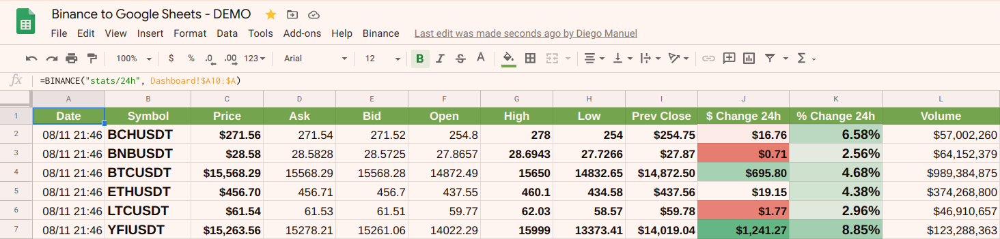

# Binance to Google Sheets!

A lightweight **Google Spreadsheets** `add-on` to GET data <u>directly</u> from **Binance API** without any intermediaries!

You can get directly in your spreadsheet, by using the `BINANCE()` formula, data fetched from Binance API like:  
* Current crypto prices
* 24h stats
* Open and Done orders
* Last update time
* ..and many more to come!

It <u>only</u> requires **Binance API keys** for open/finished orders listing, but a **READ-ONLY** API key from Binance is enough for everything to work.  
In deed, I _personally recommend_ to generate <u>READ-ONLY</u> API key at Binance site.  
It does <u>NOT</u> need write/trade access <u>in any way</u> to properly work with **ALL** its features!  

I think and hope that many of you will find it as useful as it is for myself.  
Enjoy, cheers! :beers:

## How can I use it in my Google Spreadsheets?

### If you AREN'T a developer (not available yet, coming soon)

Simple enough! Just download the **Binance to Google Sheets `add-on`** from within your desired spreadsheet using [Google Workspace Marketplace](https://gsuite.google.com/marketplace/search/binance%20to%20google%20sheets) and you are ready to go!  
Follow these simple steps:

1. With your desired `Google Spreadsheet` opened, go to `Add-ons -> Get add-ons`.
2. Search for `Binance to Google Sheets` and click on it once found.
3. Click the `Install` button and voila!

### If you ARE a developer

You will need [clasp](https://github.com/google/clasp) and [node](https://nodejs.org) in order to apply the `add-on` to your Google Spreadsheet.  

1. Install `node` and `clasp`.
2. Clone the `repo` at your local computer.
3. Get the `Script ID` for your desired Google Spreadsheet.
    1. At your `Google Spreadsheet` screen, go to `Tools -> Script editor`.
    2. At the `Google Script` screen, go to `File -> Project properties`.
    3. The needed ID is the one under the `Script ID` label!
4. Run the target `make apply SCRIPT_ID=my-script-id` replacing `my-script-id` with the ID obtained at point `3`.
    * TIP: You can set your `SCRIPT_ID` at `export SCRIPT_ID=replace-me` on `Makefile` so you can call `make apply` alone.
5. Refresh/reload your Google Spreadsheet (hit `F5`) and voila!

You can also do it **by hand**, manually copying each file content to your script source at [Google Scripts](https://script.google.com/) but it's a pain in _you-know-where_.

### Binance API Keys

Only needed if you **also want** to have pending and done orders listing working in your spreadsheet.  
To get your keys, go to [Binance API panel](https://www.binance.com/en/usercenter/settings/api-management) and create a new one:

1. Enter a label like `Binance to Google Sheets` and click the `Create` button.
2. Take note for both `API Key` and `Secret Key` values.
3. Click the `Edit restrictions` button.
    1. Under `API restrictions` **ONLY** `Can Read` checkbox should be checked.  
    2. Under `IP access restrictions` select `Unrestricted`.
4. Click the `Save` button and now you have to configure them on your spreadsheet!

Once you have the `add-on` already installed/enabled on your desired Google Spreadsheet, the main menu item `Binance` should have appeared at the rightmost position at your spreadsheet's screen.

1. At spreadsheet's main menu, go to `Binance -> Configure API Keys`.
2. Set your `API Key` and click `OK`. Do the same for `API Secret Key`.
3. Voila, you are ready to go!

**NOTE:** You can remove or re-configure them at any time from the `Binance` main menu item.

## OK, I have it installed! How do I use it at my spreadsheet?

You just need to call the `=BINANCE()` formula in a cell.  
So far, these are the available operations:

* `=BINANCE("last_update")` will return the timestamp of the last request to Binance API (**public**, no API keys needed).
* `=BINANCE("prices")` will return a list with the latest ticker prices from Binance (**public**, no API keys needed).
    * `=BINANCE("prices", "BTC", "USDT")` Optionally you can give a ticker to just return its price.
* `=BINANCE("stats/24h", A1:A3)` will return a list with the 24hs stats for given symbols from Binance (**public**, no API keys needed).
    * A single value or a range of values is required. Range values must be symbols like `A1="BTC"`, `A2="ETH"` and `A3="LTC"`.
    * `=BINANCE("stats/24h", A1:A3, "BTC")` Optionally you can give a ticker to compare (defaults to `USDT`).
* `=BINANCE("orders/done", A1:A3)` will return a list with your latest finished BUY/SELL orders for given symbols from Binance (**private**, API keys required).
    * A range of values is required. Range values must be symbols like `A1="BTC"`, `A2="ETH"` and `A3="LTC"`.
    * They will be always compared against `USDT`! Other pairs like `BTCETH` coming soon.
* `=BINANCE("orders/open")` will return a list with all your pending BUY/SELL orders from Binance (**private**, API keys required).
* `=BINANCE("version")` will return the current `Binance to Google Sheets` version you are running.

## See it working live!

https://docs.google.com/spreadsheets/d/1AcOcPFsncrDB_ve3wWMHwfiFql6A4hmG1sFc01LLTDg

## Some background: Why this tool had ever to come alive?!

I needed a way to have Binance data directly available at my Google Spreadsheet.  
First, I've looked for several existing solutions, but none provided me the _freedom_ and _confidence_ that I wanted for this kind of _delicate_ stuff (you know what I mean, right? =)  
So I decided to write my own code, all from scratch, with only my will and my javascript knownledge aboard..  
..and I was sooo happy with the results that I simply decided to share it to the world! :tada:

## Disclaimer - Terms of Service - Privacy Policy

I'm just a guy that uses both services and wanted to have **Binance** data available at my personal **Google Spreadsheet**.  
I did it for myself and I liked it so much, that I decided to share it to the world so anyone can use it!

The script only needs **READ** access keys to **Binance API**, so there is <u>no security concerns</u> about what the script is able to do at Binance in your behalf.  
It will just **retrieve** useful Binance data for your enjoyment in your spreadsheets!  =]

I'm not responsible for your private usage of this tool, although it will never cause you any trouble.

No data collect is done in any way, that's why this `add-on` doesn't require any _"controversial"_ permission from your side.  
The only _sensitive scope_ provided by Google is:
* `script.external_request`	:: Needed to **connect to Binance API** to bring data (using only GET requests).

## Binance Account

Don't you have a **Binance** account yet?  
Just register there and start trading with its fantastic platform!  
[https://www.binance.com/en/register?ref=45140860](https://www.binance.com/en/register?ref=45140860)  

## Enjoy - Donate - Buy me a beer!  =]

Thank you for using Binance to Google Sheets add-on!  
I really hope you enjoyed and loved it as much as I love to use it everyday.

If your love is strong enough, feel free to share it with me!  =D  
I will much appreciate any contribution and support to keep working on it.

I have plenty of ideas for new features and improvements.  
So far, this is just the first acceptable release, but much more could come..!

---

**[BTC] Bitcoin donate address** | **[ETH] Ethereum donate address** | **[LTC] Litecoin donate address** | **[BNB] Binance Coin donate address**
:---:|:---:|:---:|:---:
 |  |  | 
1FsN54WNibhhPhRt4vnAPRGgzaVeeFvEnM | 0x1d047bc3e46ce0351fd0c44fc2a2029512e87a97 | LZ8URuChzyuuy272isMCrts7R7UKtwnj6a | 0x1d047bc3e46ce0351fd0c44fc2a2029512e87a97

---

This software was published and released under the **GPL-3.0 License**.

Use it wisely, happy trading!  
Diego.
